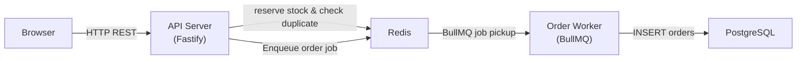
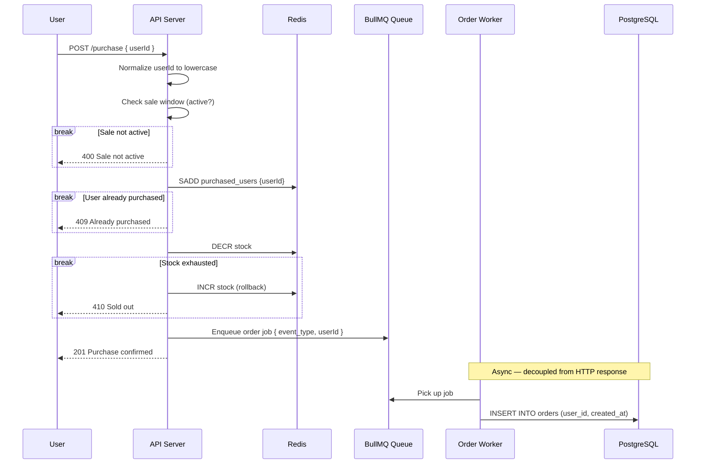
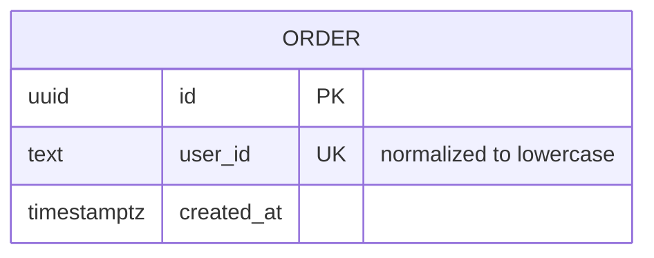

# Flash Sale System

A high-throughput flash sale backend built to handle thousands of concurrent purchase requests, with strict inventory control and race condition prevention.

---

### System Architecture

> Paste the code block into [mermaid.live](https://mermaid.live) to view it.



---

### Purchase Flow (Sequence Diagram)

> Paste the code block into [mermaid.live](https://mermaid.live) to view it.



---

## Database Design



- **Single table** — one product, one sale, one order per user
- `user_id` is the sole identity
- Uniqueness is enforced at **two layers**:
  - **Redis** `SADD purchased_users` — primary guard
  - **PostgreSQL** `UNIQUE` on `user_id` — fallback safety net on DB level
- `user_id` is always **normalized to lowercase** before storage and lookup to prevent case-variant duplicates (e.g. `XxxAnton` vs `xxxanton`)

---

## Design Choices & Trade-offs

### Why Redis for Concurrency Control?

Redis processes commands **one at a time, without interruption**. Using `DECR` for stock and `SADD` for user deduplication means no 2 requests can ever simultaneously "win" the same slot.

### Why Fastify over Express?

Fastify is my framework of choice for structured Node.js projects. Its plugin system makes the composition root pattern natural — registering Redis, BullMQ, rate limiting, and error handling as isolated plugins keeps the app factory clean and each concern independently testable. Built-in structured logging (Pino), native TypeScript support, and Zod schema validation are built-in rather than added separately. It also integrates smoothly into a monorepo setup and scales well as the codebase grows.

### Why PostgreSQL for Orders?

Orders are the financial record of the sale. After Redis exclusively confirms a successful purchase, the order is written to PostgreSQL for durability and auditability.

### Backend Architecture (DDD)

The API server follows a Domain-Driven Design structure:

- **`core/entities`** — pure domain logic (e.g. `SaleEntity.getStatus()`), no framework deps
- **`core/repositories`** — repository interfaces — the domain defines the contract, infrastructure implements it
- **`infrastructure/cache`** — Redis implementation of those interfaces
- **`modules/sale`** — feature module: use cases contain business logic, controller handles HTTP, `sale.routes.ts` is the composition root that wires all dependencies together
- **`common`** — shared utilities used across all modules: typed error classes, Fastify plugins (redis, queue, error handler)

### Worker Architecture (DDD)

The Order Worker mirrors the same DDD structure as the backend:

- **`core/entities`** — `OrderEntity.create(userId)` — pure domain object, no framework deps
- **`core/repositories`** — `IOrderRepository` interface — domain defines the DB contract
- **`infrastructure/database/prisma`** — `PrismaOrderRepository` implements the interface
- **`modules/order/order.processor.ts`** — composition root equivalent to `sale.routes.ts`: wires all dependencies and routes incoming jobs by `event_type` (e.g. `CREATE_ORDER`)
- **`modules/order/use-cases`** — `CreateOrderUseCase` contains the business logic

### Centralised Database Package

`packages/database` owns the single Prisma schema and migration history. Any app that needs DB access installs `@flash-sale/database` as a workspace dependency. No schema duplication, 1 migration command regardless of how many services use PostgreSQL.

### Why a Worker + BullMQ Queue?

The API's only job is to validate and respond fast. It shouldn't block on a DB write. Once Redis confirms a successful purchase, the API enqueues the job and immediately responds `201` to the user. The **Order Worker** picks up the job asynchronously and writes to PostgreSQL.

This decouples 2 independent concerns:
- **API service** — high-throughput HTTP + Redis, horizontally scalable
- **Worker service** — reliable DB persistence, independently scalable

BullMQ runs on top of the existing Redis instance (no extra infrastructure), natively tracks job states (`waiting`, `active`, `completed`, `failed`), and handles retries automatically. The `GET /purchase/:userId` endpoint reads from Redis, not Postgres. So users get instant feedback regardless of whether the worker has flushed yet.

> **Trade-off:** There is a brief window between purchase confirmation and DB persistence. This is acceptable because Redis is the source of truth for purchase state. Postgres is the durable audit log.

> **Why BullMQ over RabbitMQ or SQS?** I chose BullMQ specifically because I've used it in a past freelance project and was already comfortable with it. SQS was also off the table since the spec doesn't require real cloud deployment.

### No Authentication / Self-Asserted Identity

The spec mentions to "enter a username or email", so `userId` is a free-form string the user provides directly, with no registration or authentication step. The system normalizes it to lowercase and enforces uniqueness.

> **In production:** users would authenticate first, and the verified identity from the auth token would be used as `userId`.

### Monorepo (Turborepo + pnpm)

Shared TypeScript types between frontend and backend prevent drift. Turborepo's task graph ensures correct build ordering and caching.

---

## Project Structure

```
flash-sale/
├── apps/
│   ├── backend/              # Fastify API server (DDD)
│   │   ├── Dockerfile
│   │   └── src/
│   │       ├── app.ts        # Fastify app factory
│   │       ├── index.ts      # Entry point
│   │       ├── config/       # Zod env validation
│   │       ├── common/
│   │       │   ├── errors/   # AppError, typed HTTP errors
│   │       │   └── plugins/  # redis.ts, queue.ts, error-handler.ts
│   │       ├── core/
│   │       │   ├── entities/          # SaleEntity (domain logic)
│   │       │   └── repositories/      # ISaleCacheRepository (interface)
│   │       ├── infrastructure/
│   │       │   └── cache/             # SaleCacheService (Redis implementation)
│   │       └── modules/
│   │           └── sale/
│   │               ├── controllers/   # SaleController
│   │               ├── use-cases/     # GetSaleStatus, PurchaseItem, CheckPurchase
│   │               └── sale.routes.ts # Composition root
├── worker/               # Order Worker (BullMQ consumer, DDD)
│   ├── Dockerfile
│   └── src/
│       ├── index.ts        # Entry point — wires Worker + OrderProcessor
│       ├── config/         # Zod env validation
│       ├── core/
│       │   ├── entities/            # OrderEntity (domain object)
│       │   └── repositories/        # IOrderRepository (interface)
│       ├── infrastructure/
│       │   └── database/
│       │       └── prisma/
│       │           └── repositories/ # PrismaOrderRepository
│       └── modules/
│           └── order/
│               ├── order.processor.ts  # Composition root — routes by event_type
│               └── use-cases/          # CreateOrderUseCase
└── web/                  # React frontend (Vite + Tailwind v4)
|    ├── Dockerfile
|    ├── nginx.conf
|    └── src/
|        ├── main.tsx        # Entry point
|        ├── App.tsx         # Single-page UI (3 sale states)
|        ├── index.css       # Tailwind v4 directives + custom utilities
|        └── lib/
|            └── utils.ts    # cn() — clsx + tailwind-merge
├── packages/
│   ├── shared/               # Shared TypeScript types & Zod schemas
│   └── database/             # Centralised Prisma schema & migrations
│       └── prisma/
│           ├── schema.prisma # Single source of truth for all tables
│           └── migrations/
├── tests/
│   └── stress/               # k6 stress test scripts
├── docker-compose.yml        # Full application: redis, postgres, migrate, backend, worker, web
├── Dockerfile.migrate        # One-shot Prisma migration runner
├── turbo.json
└── package.json
```

---

## Prerequisites

- [Node.js](https://nodejs.org/) >= 20
- [pnpm](https://pnpm.io/) >= 9
- [Docker](https://www.docker.com/) & Docker Compose

---

## Getting Started

### 1. Clone

```bash
git clone git@github.com:edharmowongso/flash-sale.git
cd flash-sale
```

### 2. Configure Environment

```bash
cp .env.example .env
```

Open `.env` and update the sale window to a time that fits your testing:

```dotenv
# Set these to a window in the near future (ISO 8601 UTC)
SALE_START=2026-03-21T10:00:00Z
SALE_END=2026-03-21T11:00:00Z
SALE_STOCK=1000
```

All other values (Redis URL, database URL, ports) are pre-configured to match the Docker Compose defaults and do **not** need to be changed.

> **Note:** `DATABASE_URL` in `.env.example` uses credentials (`flashsale`/`flashsale`) that match `docker compose.yml`. Only change it if you are pointing to an external database.

> **Important:** If you change `.env` while containers are already running, you must **recreate** the affected containers — a plain `restart` will not pick up the new values:
> ```bash
> docker compose up -d --force-recreate backend worker
> ```

### Environment Variables

| Variable             | Default                  | Description                         |
|----------------------|--------------------------|-------------------------------------|
| `PORT`               | `3000`                   | API server port                     |
| `REDIS_URL`          | `redis://localhost:6379` | Redis connection URL (API + Worker) |
| `DATABASE_URL`       | `postgresql://...`       | PostgreSQL connection string        |
| `SALE_START`         | —                        | ISO 8601 sale start time            |
| `SALE_END`           | —                        | ISO 8601 sale end time              |
| `SALE_STOCK`         | `100`                    | Total units available               |
| `WORKER_CONCURRENCY` | `5`                      | BullMQ parallel jobs per worker     |
| `CORS_ORIGIN`        | `http://localhost:5173`  | Allowed CORS origin                 |
| `VITE_API_URL`       | `http://localhost:3000`  | API base URL (frontend only)        |

> **Production note:** I used environment variables for `SALE_START`, `SALE_END`, and `SALE_STOCK` to keep this simple. In production I'd store these in a `sales` table instead — that allows dynamic scheduling and admin management without redeployment.

### 3. Build & Start All Services

```bash
docker compose build
docker compose up
```

Docker Compose starts services in the correct order automatically:
1. **Redis** + **PostgreSQL** start first
2. **migrate** runs `prisma migrate deploy` and exits
3. **backend** + **worker** start once migration is confirmed
4. **web** starts once the backend is up

| Service  | URL                   | Description                              |
|----------|-----------------------|------------------------------------------|
| API      | http://localhost:3000 | Fastify REST API                         |
| Worker   | (no HTTP port)        | BullMQ consumer — processes order jobs   |
| Frontend | http://localhost:5173 | React + Vite UI (served via nginx)       |

Open [http://localhost:5173](http://localhost:5173) in your browser. The UI will reflect the sale state based on the `SALE_START` / `SALE_END` window you configured above.

To rebuild a specific service only:

```bash
docker compose build backend
docker compose build worker
docker compose build web
```

To run individual services:

```bash
# API only (starts redis, postgres, migrate, then backend)
docker compose up backend

# Worker only (starts redis, postgres, migrate, then worker)
docker compose up worker

# Frontend only (starts backend and its deps, then web)
docker compose up web
```

To stop and clean up:

```bash
# Stop all containers
docker compose down

# Stop and remove volumes (wipes Redis + PostgreSQL data)
docker compose down -v
```

> **Note on `VITE_API_URL`:** This variable is baked into the frontend bundle at image build time. It defaults to `http://localhost:3000`.

---

## API Endpoints

| Method | Endpoint            | Description                                      |
|--------|---------------------|--------------------------------------------------|
| GET    | `/sale/status`      | Get current sale status and stock                |
| POST   | `/purchase`         | Attempt to purchase (body: `userId`)             |
| GET    | `/purchase/:userId` | Check if user has purchased (`userId` lowercase) |

### Sale Status Response

```json
{
  "status": "active",
  "stockRemaining": 87,
  "startTime": "2026-03-21T10:00:00Z",
  "endTime": "2026-03-21T11:00:00Z"
}
```

### Purchase Request

`userId` accepts an email or username. It is **normalized to lowercase** server-side before processing.

```json
{ "userId": "alice@example.com" }
```

### Purchase Response

```json
{ "success": true, "code": "SUCCESS", "message": "Purchase confirmed! Your order is being processed" }
```

---

## Running Tests

### Unit & Integration Tests

Tests use [Vitest](https://vitest.dev/) and live in both `apps/backend` and `apps/worker`.

**Backend** (`apps/backend`) | 23 tests across 5 files:
- **Unit** — `SaleEntity.getStatus()`, and all 3 use cases (`PurchaseItemUseCase`, `GetSaleStatusUseCase`, `CheckPurchaseUseCase`)
- **Integration** — all 3 API endpoints (`GET /sale/status`, `POST /purchase`, `GET /purchase/:userId`)

**Worker** (`apps/worker`) | 10 tests across 3 files:
- **Unit** — `OrderEntity.create()`, `CreateOrderUseCase`, `OrderProcessor`

Run all tests from the repo root:

```bash
# Backend only
pnpm --filter @flash-sale/backend test

# Worker only
pnpm --filter @flash-sale/worker test

# Both at once
pnpm --filter @flash-sale/backend test && pnpm --filter @flash-sale/worker test
```

---

## Stress Tests

Stress tests simulate a high number of concurrent users attempting to purchase simultaneously to verify:
1. Stock never goes below 0 (no overselling)
2. No user purchases more than once
3. System remains stable under load

### Prerequisites

Install [k6](https://k6.io/docs/getting-started/installation/) (see link for other platforms):

```bash
# macOS
brew install k6
```

### Run Stress Test

The API must be running and the sale window must be **active** before starting the test. Make sure `SALE_START` / `SALE_END` in your `.env` covers the time you run the test.

> **Before every run:** flush Redis so stock is re-initialized from `SALE_STOCK`:
> ```bash
> docker compose exec redis redis-cli FLUSHALL
> ```

> **Rate limit:** The backend defaults to 200 requests/minute (per IP) which will throttle k6's concurrent VUs. For stress testing, temporarily raise it in `apps/backend/src/app.ts`:
> ```ts
> await app.register(rateLimit, { max: 1000000, timeWindow: "1 minute" });
> ```
> Remember to rebuild (`docker compose build backend`) and revert when done.

```bash
# Terminal 1 — start the full stack (or just the backend + its deps)
docker compose up backend

# Terminal 2
k6 run tests/stress/purchase.js
```

k6 runs on your host machine and hits the API at `http://localhost:3000`, which is port-mapped from the backend container.

### Expected Results

With 1000 stock and 2000 virtual users:

```
✓ http_req_failed   rate<0.01%
✓ no 5xx errors

purchase_success............: exactly 1000
purchase_already_bought.....: ~(VUs that retried after success)
purchase_sold_out...........: remaining requests after stock exhausted
```

### Post-Test DB Verification

After the stress test completes, verify the worker drained the queue correctly and Postgres is consistent with Redis:

```bash
docker compose exec postgres psql -U flashsale -d flashsale -c "SELECT COUNT(*) FROM orders;"
```

Expected: exactly `SALE_STOCK` rows (e.g. `1000`).

No overselling, and every confirmed purchase saved to the database.
